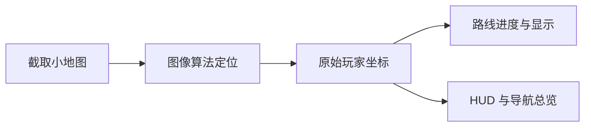

# 追踪定位

SIFT Map Tracker 周期性截取游戏小地图，在本地识别其对应的大地图位置，并把坐标发送给客户端。整个过程不读取游戏进程内存。

## 正常工作链路

路线吸附只用于导航显示和进度计算，不应改变原始追踪坐标。

## 状态说明

- **未启动**：本地识图服务尚未运行。
- **等待首帧**：服务已启动，正在等待有效截图或首次定位。
- **追踪中**：持续获得可用坐标。
- **搜索/重定位**：当前帧无法稳定匹配，正在保留旧位置并尝试恢复。
- **服务已停止**：用户停止服务，或服务因错误退出。

## 定位困难区域

大面积纯草地、雪地、海面和重复纹理缺少稳定特征，SIFT 与模板算法都可能无法区分具体位置。建议：

- 移动到道路、建筑、岸线或地标附近；
- 保持小地图无遮挡；
- 不要通过压低刷新间隔强行提升定位率；
- 使用“定位风险图”预先判断路线中的高风险区域。

